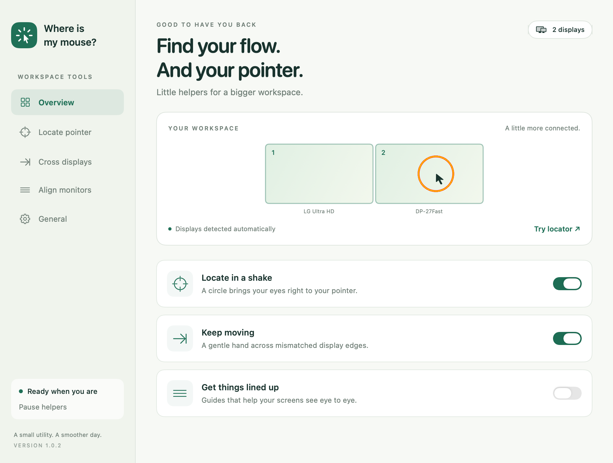

# Where is My Mouse?

A native macOS recreation of the original [Where is My Mouse?](https://macnews.tistory.com/4007). A small menu-bar utility for finding your pointer, getting past blocked display edges, and physically lining up monitors.

This project is public simply to share the prebuilt macOS app with anyone who may find it useful.

Requires macOS 13 Ventura or later. Written in Swift, AppKit, and SwiftUI, with no third-party dependencies and no network access.



## GitHub builds and downloads

**[Download for macOS](https://github.com/macgebi/mac_mouse_helper/releases/latest/download/Where-is-My-Mouse-macOS-universal.zip)** — no GitHub account required. The same app supports Apple Silicon and Intel Macs running macOS 13 or later. Unzip it and move `Where is My Mouse.app` into Applications.

From the repository page, open **Releases → Latest → Assets** and select **Where-is-My-Mouse-macOS-universal.zip**. The optional `.sha256` file lets you verify the download.

The [Build macOS app workflow](https://github.com/macgebi/mac_mouse_helper/actions/workflows/macos.yml) tests and builds the modern Swift app on each push and pull request. Development builds remain available under a successful run’s **Artifacts**, which require GitHub sign-in and expire after 14 days.

These initial builds are ad-hoc signed, without Apple notarization. See [GitHub builds and releases](docs/GITHUB.md) for first-launch approval, version tags, draft releases, and the later Developer ID signing setup. No Apple credentials or manually created GitHub secrets are needed for the current workflow.

The original Objective-C project remains in `whereismymouse/`, `whereismymouse.xcodeproj/`, and `whereismymouseTests/` for reference. The workflow builds the new `Package.swift` project.

## Build and open

Install Apple's Command Line Tools (`xcode-select --install`) if needed, then:

```sh
./scripts/build.sh
open "dist/Where is My Mouse.app" --args --settings
```

The script builds for the current Mac's architecture and makes an ad-hoc-signed app bundle. For a universal build and verified download archive, run:

```sh
UNIVERSAL=1 ./scripts/build.sh
./scripts/package.sh
```

You can copy the app into Applications before granting permissions so its location stays stable. To develop in Xcode, open `Package.swift`.

For a Developer ID build, set `SIGNING_IDENTITY` to your signing identity. Notarization is not yet automated. Ad-hoc signatures may require permissions to be granted again after rebuilding; stable Developer ID signing avoids changing the app's signing identity.

## Features

- **Shake to locate:** deliberate back-and-forth movement triggers the original **red–yellow–red radial-gradient circle**, centered on the moving pointer. Its band is 10% of the radius, capped at 60 desktop points, and contracts linearly to the pointer over 1.5 seconds. These colors, proportions, and timing are preserved from the original app because a user with low vision found them helpful. Its initial radius reaches the farthest corner of all connected displays. It draws across all displays and honors macOS Reduce Motion. The menu and **Control–Option–Command–L** also trigger it.
- **Crossing assistance:** continued outward movement at a blocked part of a shared edge moves the pointer into the adjacent screen at a proportional position. Supports left/right and above/below layouts, negative desktop coordinates, different resolutions, and scaled displays. It requires sustained intent, allows normal crossings, ignores drags, and applies a cooldown to prevent bouncing. Outer edges without a neighbor are left alone. Displays must adjoin in macOS Display Settings (within four desktop points).
- **Larger pointer after crossing:** a temporary enlarged arrow tracks the same pointer hotspot and shrinks back after a configurable interval. It is a click-through visual overlay, not a modification to the system-wide cursor-size preference. The original system pointer stays functional and visible underneath; no private cursor APIs or cursor-hiding state are used.
- **Alignment guides:** nine horizontal lines by default, with a choice of 3, 5, 7, 9, or 11. Each numbered line has a different color, matched across monitors. Lines are 4 points thick by default, adjustable from 2–10 points, with a dark outline for visibility on light backgrounds. Optional monitor/line labels, physical spacing, and vertical offset remain adjustable. **Physical alignment** uses each display's reported millimeter size for consistent physical spacing; line centers align display centers. **Desktop coordinates** uses common global y-coordinates based on the primary screen's height. Toggle from the menu or **Control–Option–Command–A**. Guides never intercept clicks and are off at launch.
- Individual feature switches, a pause control in the menu bar, launch at login, and persistent settings. Closing Settings leaves the menu-bar helper running; Quit exits it.

## First-time setup

Open **Settings → General** in the app:

Shake recognition and crossing assistance are **off on a fresh install**. Turning either feature on from the menu bar, Overview, or its Settings page opens the needed macOS permission page with the draggable app helper. Crossing requests Input Monitoring first, then Accessibility once Input Monitoring is granted. A dash in the menu means the requested feature is waiting for permission; a checkmark means its required permissions are granted. Click a pending menu item again to cancel setup. Permission polling never repeatedly opens System Settings after a denial.

1. Enable **Input Monitoring** in macOS System Settings to observe mouse movement and its delta at display edges.
2. Enable **Accessibility** to allow assisted pointer movement.
3. If macOS asks to quit and reopen, do so. Otherwise access is detected automatically within two seconds.

The **Enable…** buttons also open a small floating helper with a **draggable app icon**. Drag it directly into the corresponding System Settings permission list and turn the app's switch on. The helper stays above System Settings and always supplies the actual running `.app` bundle, including when it is in your personal Applications folder. It only offers copying the app reference, never moving the app.

The same helper is available from **Drag app to Input Monitoring…** and **Drag app to Accessibility…**. If a macOS version doesn't accept dropping into the list, use **Show in Finder**, or **Copy app path**, then click **+** in System Settings and press **Shift–Command–G** to paste that path. The app never grants its own permissions or treats a completed drag as proof of authorization.

The app never requests permissions at launch; enabling a feature or pressing an Enable button starts setup. Locator previews and alignment guides work without permissions. Global shortcuts use Carbon hotkey registration, so the app doesn't monitor typing. macOS's own “Shake mouse pointer to locate” option may enlarge the cursor alongside this app's locator; either behavior can be used independently.

Launch at login is optional and uses Apple's `SMAppService`. Enable or disable it in **General → Launch at login** or directly in the status-item menu. When enabled, the utility starts when you sign in after starting or restarting your Mac. Login launches stay quietly in the menu bar; Settings is not restored automatically. While Settings is open, the app appears in **Command-Tab and the Dock**, including when Settings is hidden or minimized. Closing Settings with its close button or **Command-W** returns to menu-bar-only mode and leaves the helpers running. macOS may require approval in Login Items, which the app reports explicitly.

Use a stable installation path (such as `~/Applications/Where is My Mouse.app`) before enabling login launch. Ordinary launches never override your login preference. For an explicitly requested installation with login enabled, the app supports `--enable-login`; `--background` starts without showing Settings. The utility does not require Screen Recording or collect mouse history, analytics, or other user data.

## Verify

```sh
./scripts/test.sh

# Close any running copy first. Exports this app's own views and overlays.
"dist/Where is My Mouse.app/Contents/MacOS/WhereIsMyMouse" \
  --smoke-test /tmp/where-is-my-mouse-previews
```

The standalone core test runner works with Command Line Tools alone (XCTest requires full Xcode on this Mac). It exits nonzero on failures. Tests cover ring geometry, four-way crossing, negative coordinates, normal and blocked edges, three-display layouts, mirrored/unrelated displays, intent thresholds, cooldowns, shake detection at high report rates, jitter rejection, and physical guide spacing.

Real hardware acceptance checks are in [docs/TESTING.md](docs/TESTING.md). OS permission grants and true device input at blocked edges need manual verification on the user's multi-monitor setup; synthetic events and geometry tests cannot fully substitute for those checks.

The current build's completed checks and remaining manual checks are recorded in [docs/VERIFICATION.md](docs/VERIFICATION.md).

The original locator's exact appearance and source references are recorded in [docs/LOCATOR-DESIGN.md](docs/LOCATOR-DESIGN.md).

## Structure

- `Sources/MouseCore`: deterministic geometry and motion detection, independent of UI and permissions.
- `Sources/WhereIsMyMouse`: native app lifecycle, permission state, read-only mouse event tap, hotkeys, display discovery, transparent overlays, and settings.
- `Tests/MouseCoreTests`: unit tests for the behavior that decides when and where to assist.
- `scripts`: app-bundle packaging and a vector-drawn app icon.

Desktop geometry uses Quartz points with its origin at the primary display's top-left. Backing pixels are never mixed with logical coordinates. Each monitor has its own transparent panel, so Retina scales and disconnected/rearranged displays can be handled independently. Animation timers run only during a locator or pointer highlight; static guides don't need a continuous render loop.

## Known limits

- Screen Recording-protected surfaces and secure system UI can cover ordinary overlay windows.
- Reported physical display dimensions can be absent or inaccurate. The app identifies missing dimensions and uses estimated 96 dpi spacing; use a ruler to validate reported dimensions if exact alignment matters. Desktop-coordinate guides don't imply equal physical spacing.
- Edge assistance relies on the mouse delta in a session event tap. Third-party mouse drivers, remote desktop software, and virtual input devices can change those deltas and require hardware testing.
- Cursor overlays depict an arrow even if the destination app uses a different cursor shape. They don't enlarge another app's I-beam or custom cursor.
