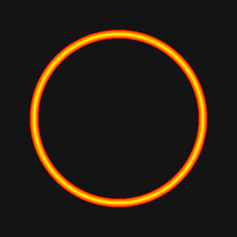

# Preserve the original locator

The original app's creator reported that a user with low vision found its circle particularly helpful. Preserving this design is a product requirement. The locator is intentionally independent of the settings window's green decorative palette.

Reference revision: `a563e689a06d3b6226e63cadc0813b321e9cbd73` in the creator's `macgebi/mac_mouse_helper` repository.

- [GrandCircleView.m](https://github.com/macgebi/mac_mouse_helper/blob/a563e689a06d3b6226e63cadc0813b321e9cbd73/whereismymouse/GrandCircleView.m) uses `NSGradient` with `NSColor.red`, `NSColor.yellow`, `NSColor.red`. The colors are evenly spaced from the outer to the inner edge. Both the circle's interior and its surroundings remain transparent.
- Band width is `min(radius * 0.1, 60)` desktop points. Use the original `max(radius * 0.9, radius - 60)` inner-radius calculation.
- [ShakeDisplayManager.m](https://github.com/macgebi/mac_mouse_helper/blob/a563e689a06d3b6226e63cadc0813b321e9cbd73/whereismymouse/ShakeDisplayManager.m) contracts the circle linearly over 1.5 seconds. Preserve full opacity during that sweep and let it finish before starting another.
- `CursorShowView.m` contains a similar gradient with a 100-point cap, but it is **not** the class instantiated by the original shake locator. Use the 60-point cap from `GrandCircleView`.

`LocatorAppearance.swift` shares the same AppKit renderer between the live overlay and both settings previews. Do not replace it with a muted accent color, thin outline, or decorative glow. The Reduce Motion option retains the same colors in a stationary fading ring.

## Rendering check

Generate snapshots of the production renderer without opening windows or capturing the desktop:

```sh
CLANG_MODULE_CACHE_PATH="$PWD/.build/ModuleCache" swiftc \
  Sources/WhereIsMyMouse/LocatorAppearance.swift scripts/render-locator.swift \
  -o .build/render-locator
.build/render-locator .build/locator-previews
```



This preserves the original design; it does not establish that the design works for every person's vision. Further accessibility changes should retain this appearance as an option and be validated with the people relying on it.
